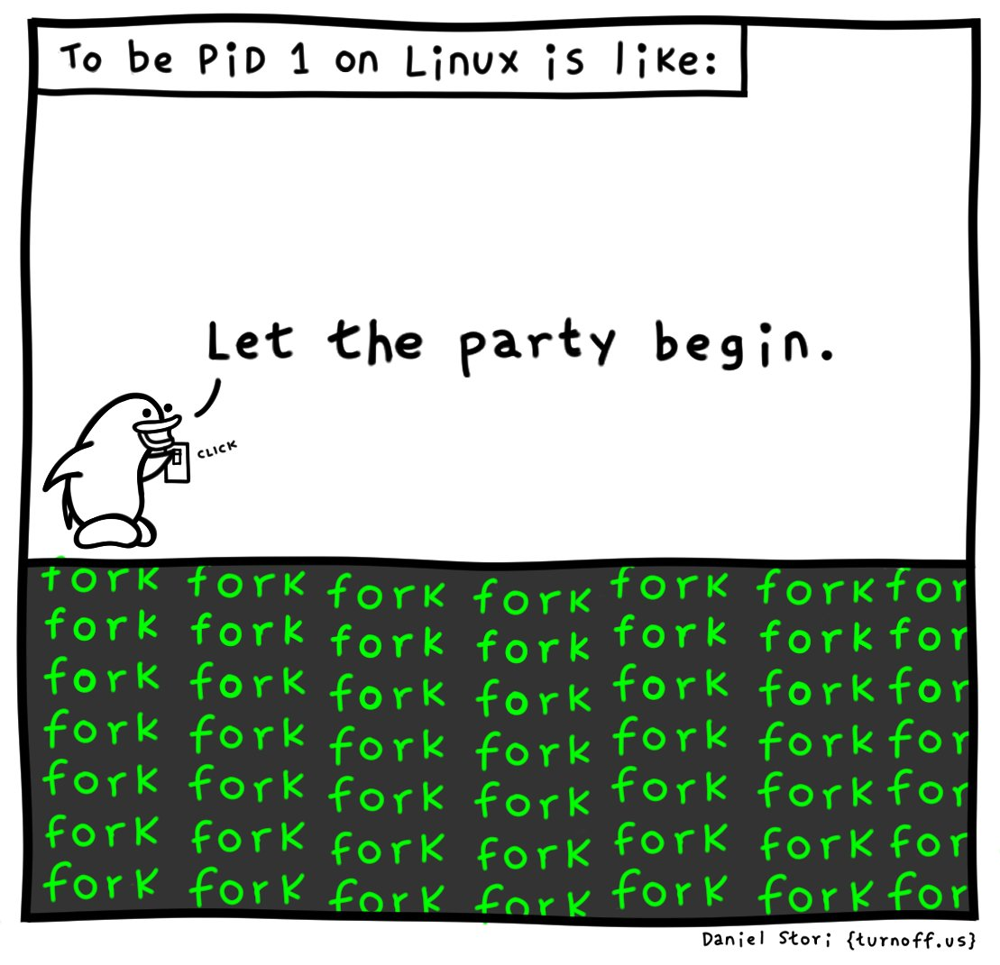

# Operating Systems (1INF29)

Labs and materials from the **Operating Systems** course at PUCP, **taught by Viktor Khlebnikov in semesters 2024-1 and 2024-2**. It includes solutions and theoretical guides covering operating systems concepts.

## Topics

1. Linux fundamentals and shell scripting
2. Process management in C using `fork()`
3. Multiprogramming with _POSIX_ threads in C
4. Concurrent programming in Go
5. CPU scheduling algorithms implementation
6. Custom memory allocator (`xmalloc`) in C
7. FAT file system

---

**Note**: It is recommended to review the reference [books](/books).
