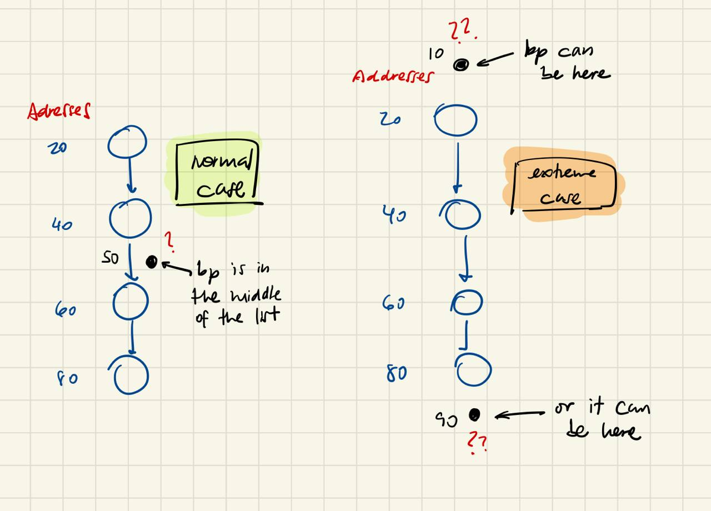

# xrun.c
This code includes the `main` method.

It calls the `xmalloc` method 7 times.

```c
unsigned int x = 0;
do {
	...
	x++;
} while (x <= 6);
```

The goal is to allocate memory multiple times and with different sizes each time: $1.5$, $2.5$, $4.5$, and so on.
# xalloc.c
This code is based on the contents from *The C Programming Language*.
## header
The `header` is the data structure we will use to store the **pointer to the next node** (hole) in the list and the **actual size of the node** measured in `Align` units.

```c
typedef long Align;

union header {
	struct {
		union header* ptr;
		size_t size;
	} s;
	Align x;
};

typedef union header Header;
```
## base
Is the fake hole that serves as the start of the list.

```c
static Header base;
```
## freep
Always points to the previous hole in the list, from where we want to start looking for a hole.

```c
static Header* freep = NULL; // at first there is no previous hole
```
## morecore
Increases the size of the heap with `sbrk`.

```c
static Header* morecore(size_t nu) {
	char* cp;
	Header* up;
	if (nu < NALLOC) nu = NALLOC; // minimmum number of units
	cp = sbrk(nu * sizeof(Header));
	if (cp == (char*)-1) return NULL; // heap cannot keep growing
	up = (Header*)cp; // up is the pointer to the new hole
	up->s.size = nu; // we save the size of the new hole
	xfree((void*)(up+1)); // we add the hole to the list
	return freep;
}
```
## xmalloc
This methods convert the requested number of bytes into a Headers-based size.

**On the first call** it creates a list with a single hole with size $0$ (the *fake* hole). On **following calls**, it iterates through the list.

**If it finds a suitable hole**, takes the needed space from it, and returns the pointer to the data space (to skip the header).

**If it does not find a suitable hole**, it calls the `morecore` method to ask the system for more space. **If this call fails**, the methods just returns `NULL`. **Else**, it gets the requested space (a hole is added to the list), and restarts the search.

```c
void* xmalloc(size_t nbytes) {
	Header* p, *prevp;
	/* we need the size in terms of Headers and rounded by excess */
	size_t nunits = (nbytes + sizeof(Header) - 1) / sizeof(Header) + 1;
	if (!(prev=freep)) {
		base.s.ptr = freep = prevp = &base;
		base.s.size = 0;
	}
	for (p=prev->s.ptr; ; prevp=p, p=p->s.ptr) {
		if (p->s.size >= nunits) { // this hole is big enough
			if (p->s.size == nunits) // the exact size we need
				prev->s.ptr = p->s.ptr; // just 
			else {
				p->s.size -= nunits; // hole has less space
				p += p->s.size; // the pointer goes to the new block
				p->s.size = nunits; // this block has the requested size
			}
			freep = prevp; // 
			return (void*)(p+1); // pointer to the block skipping the header
		}
		if (p==freep) // when returning to freep, asks for more memory
			if (!(p=morecore(nunits))) return NULL; // no memory left :(
	}
}
```
## xfree
This method is explained with detail below.

```c
void xfree(void* ap) {
	Header* p, *bp = (Header*)ap - 1; // bp points to the header of ap
	for (p=freep; !(bp > p && bp < p->s.ptr); p=p->s.ptr)
		if (p >= p->s.ptr && (bp>p || bp < p->s.ptr)) break;
	if (bp + bp->s.size == p->s.ptr) { // normal case or before all
		bp->s.size += p->s.ptr->s.size;
		bp->s.ptr = p->s.ptr->s.ptr;
	} else bp->s.ptr = p->s.ptr; // link last hole with first hole
	if (p + p->s.size == bp) {
		p->s.size += bp->s.size;
		p->s.ptr = bp->s.ptr;
	} else p->s.ptr = bp;
	freep = p; // the hole before bp, needed for next-fit
}
```

Further explanation of this code:
### what does this loop do????

```c
for (p=freep; !(bp > p && bp < p->s.ptr); p=p->s.ptr)
	if (p >= p->s.ptr && (bp>p || bp < p->s.ptr)) break;
```

We know we need to find two holes: the ones that are before and after `bp`. It can happen two situations:
- *normal* case: `bp` is in the **middle** of the list
- *extreme* case: `bp` is not in the middle of the list, but **on one extreme** (before all the holes, or after all the holes) based on its memory address



To handle this situation, when we iterate trough the list we need to identify the two moments where we can stop.

- for the *normal* case: we stop when `bp > p` and `bp < p->s.ptr`. because it will mean the hole to insert is between two holes in the middle of the list. **this is why in the code this is called as the *normal* exit of the loop.**
- for the *extreme* case: if at any point during the loop, `p` points to an address higher than `p->s.ptr`, it would mean we have reached the *extreme* case. then we check if `bp > p` (`bp` is *after* the last hole) or if `bp < p->s.ptr` (`bp` is *before* all the holes). if this two things happen at the same time then we are sure we are in the *extreme* case, so we have found `p` and we can exit the loop. **this corresponds to the `if` block with a `break` statement.**

### what are the ifs for?
Ok, **we know the value of `p` (previous hole's address) and `p->s.ptr` (next hole's address)**. so now we must connect our new hole (`bp`) into the list. how to do so?

first **lets connect it to the next hole** (`p->s.ptr`):

```c
if (bp + bp->s.size == p->s.ptr) { // normal case or before all
	bp->s.size += p->s.ptr->s.size;
	bp->s.ptr = p->s.ptr->s.ptr;
} else bp->s.ptr = p->s.ptr; // link last hole with first hole
```

- if the next hole is *before* `bp` (at a higher memory address) it means we need to **increment the size of the hole** (`+=`) and **connect its following hole** (`p->s.ptr->s.ptr`).
- if the hole is *after* `bp` (at a lower memory address) it means `bp` is at the bottom, so we **just connect it with the next hole**

something similar happens when connecting it to the previous hole (`p`):

```c
if (p + p->s.size == bp) {
	p->s.size += bp->s.size;
	p->s.ptr = bp->s.ptr;
} else p->s.ptr = bp;
```

- if `bp` is *after* `p` (at a higher memory address) it means we need to **increment the size of the hole `p`** (`+=`) and **connect it to `bp`'s following hole** (`bp->s.ptr`).
- if `bp` is *before* `p` (at a lower memory address) it means `bp` is at the beginning of the list, so we **just connect `p` with `bp`**
